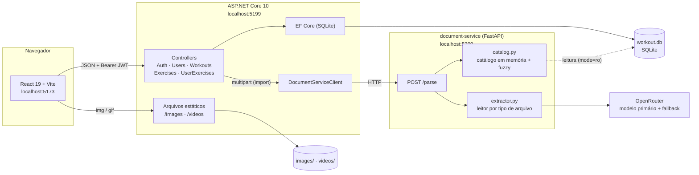
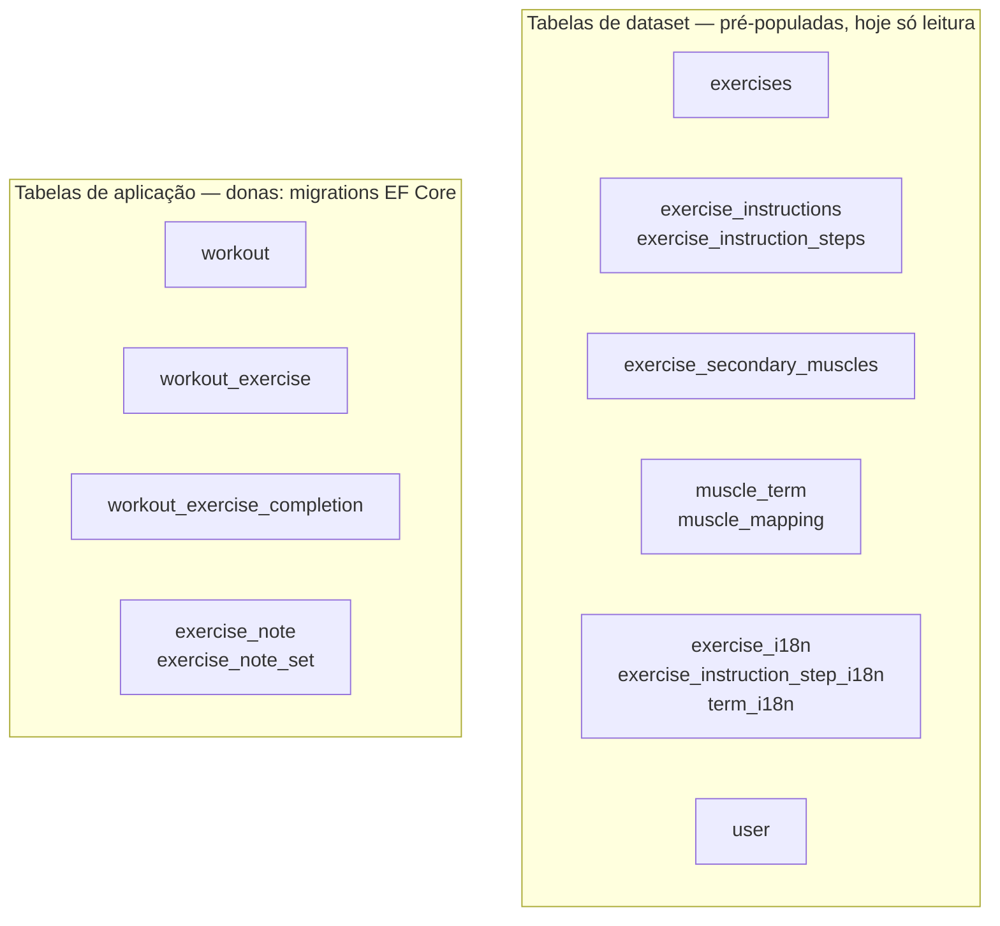
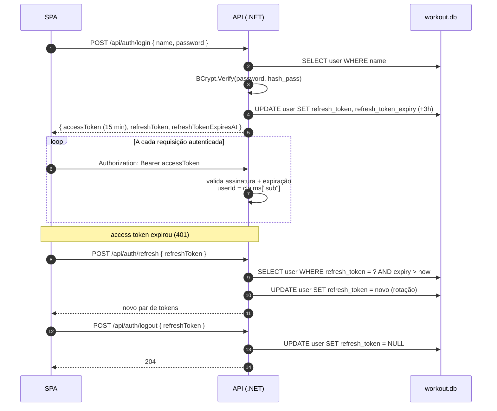
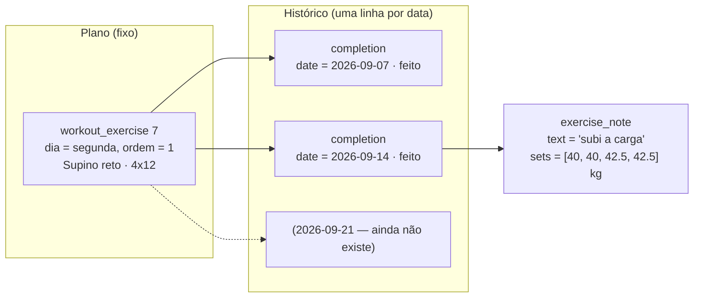
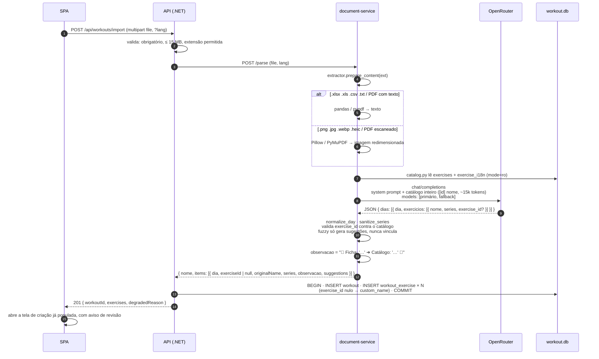
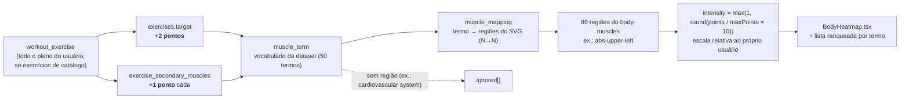
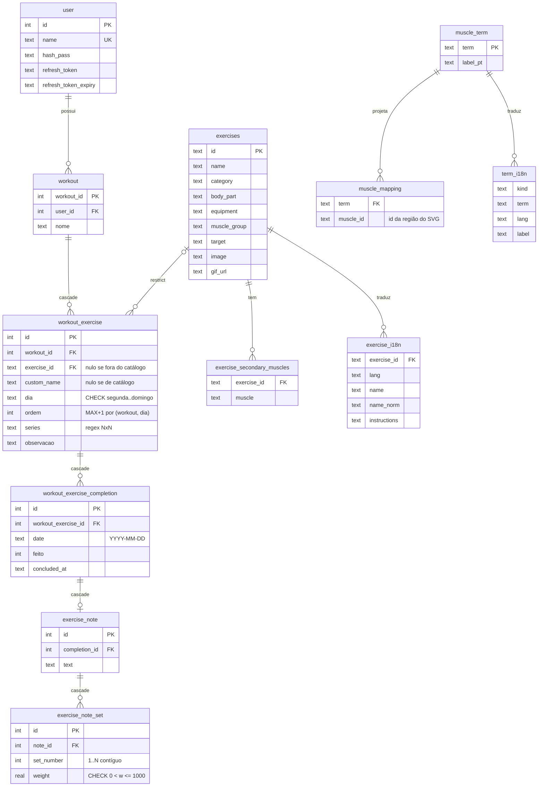

<p align="center">
  
</p>

<h1 align="center">WorkoutOrganizer</h1>

<p align="center">
  Monte seus treinos por dia da semana, marque o que fez, importe a ficha da academia por foto
  e veja no mapa corporal quais músculos o seu plano está trabalhando.
</p>

<p align="center">
  
  
  
  
  
</p>

---

## Sumário

- [O que ele faz](#o-que-ele-faz)
- [Arquitetura](#arquitetura)
- [Como funciona, peça por peça](#como-funciona-peça-por-peça)
  - [1. Autenticação](#1-autenticação)
  - [2. Ciclo semanal e conclusão por data](#2-ciclo-semanal-e-conclusão-por-data)
  - [3. Importação de ficha por documento](#3-importação-de-ficha-por-documento)
  - [4. Heatmap muscular](#4-heatmap-muscular)
  - [5. Internacionalização](#5-internacionalização)
- [Modelo de dados](#modelo-de-dados)
- [Rodando o projeto](#rodando-o-projeto)
- [Verificando](#verificando)
- [Estrutura do repositório](#estrutura-do-repositório)
- [Regras que não se quebram](#regras-que-não-se-quebram)
- [Documentação](#documentação)
- [Dataset de exercícios](#dataset-de-exercícios)

---

## O que ele faz

| | |
|---|---|
| 🗓️ **Treinos por dia da semana** | Cada treino tem exercícios distribuídos de `segunda` a `domingo`, com séries (`4x12`), ordem e observação. Editar, trocar, excluir e arrastar na criação. |
| ✅ **Marcar o que foi feito** | A conclusão é registrada numa **data absoluta**, não no dia da semana — a mesma segunda pode estar feita esta semana e pendente na próxima, sem nenhuma rotina de "virar a semana". |
| 📓 **Anotações da sessão** | Peso por série e observação livre penduradas na conclusão. O que você fez em 12/09 não muda quando o plano muda. |
| 📆 **Calendário mensal** | Visão do mês com os dias concluídos e um modal de celebração quando todo o dia é fechado. |
| 📸 **Importar ficha por foto/PDF/planilha** | Envie a ficha da academia (imagem, HEIC, PDF, XLSX, CSV, TXT). Um microserviço Python extrai a rotina via LLM, casa cada linha com o catálogo de 1324 exercícios e devolve o treino pronto para revisão. |
| 💪 **Heatmap muscular** | Cada exercício do plano pontua o músculo alvo (2) e os secundários (1); a soma é projetada em 80 regiões de um SVG do corpo humano. |
| 🌐 **PT / EN** | Todo texto do dataset (nomes, instruções, grupos musculares) tem tradução em tabelas próprias; a interface troca de idioma sem recarregar. |
| 🎬 **Catálogo com mídia** | 1324 exercícios com imagem, GIF de execução e passo a passo, servidos pela própria API. |

---

## Arquitetura

Três processos e um arquivo SQLite compartilhado (`workout.db`, fora do controle de versão —
veja [Rodando o projeto](#rodando-o-projeto)). O banco tem tabelas de **dataset**, populadas uma
única vez e hoje só lidas, e tabelas de **aplicação**, geridas por migrations do EF Core; um
terceiro processo (`document-service`) só lê o banco (`mode=ro`).



**Como `workout.db` é dividido:**



No EF, as tabelas de dataset são mapeadas com `ToTable(..., t => t.ExcludeFromMigrations())`:
o .NET lê delas, nunca as recria. Elas foram populadas uma única vez a partir do
[dataset de exercícios](#dataset-de-exercícios); os scripts que fizeram essa importação não
fazem mais parte do repositório, então hoje essas tabelas não têm um processo de reconstrução —
mudar esses dados é edição manual no banco. A única exceção é `user.refresh_token`, adicionada
por `ALTER TABLE` escrito à mão dentro de uma migration.

---

## Como funciona, peça por peça

### 1. Autenticação

Access token JWT de **15 min** + refresh token opaco de **3 h**, rotacionado a cada uso e
guardado em `user.refresh_token`. O `userId` **sempre** sai do claim `sub` do token — nenhuma
rota aceita id de dono no corpo, na query ou na rota.



> `MapInboundClaims = false` no JwtBearer é o que faz o claim `sub` chegar intacto — sem isso o
> ASP.NET Core o renomeia para `ClaimTypes.NameIdentifier`.

### 2. Ciclo semanal e conclusão por data

A semana **não é um estado que reseta**: é uma janela de 7 datas calculada a partir de "hoje"
(`frontend/src/lib/weekCycle.ts`). O plano define *o que* fazer em cada dia da semana; a
tabela `workout_exercise_completion` registra *em qual data* cada slot foi feito.



Regras que o servidor impõe:

- `POST .../completions { date }` é **upsert** — marcar duas vezes a mesma data não duplica.
- A data tem de cair no mesmo dia da semana do slot (`400` caso contrário).
- A resposta traz `diaConcluido: true` quando **todo** exercício de **todos** os treinos do
  usuário agendado naquele dia da semana está feito nessa data — é o gatilho do modal de celebração.
- A anotação (`exercise_note`) pende da **conclusão**, não do slot: só se anota o que já foi feito
  (`404` sem conclusão), e apagar o slot cascateia conclusões e anotações.

### 3. Importação de ficha por documento

O backend é só um gateway autenticado. Quem lê o arquivo e fala com o LLM é o
`document-service` (FastAPI, porta 5200). Cada tipo de arquivo usa a estratégia **mais barata
que o resolve**: planilha e PDF digital viram texto determinístico; imagem, HEIC e PDF escaneado
seguem pelo caminho multimodal.



Decisões que vieram da medição, não da intuição:

- **O fuzzy matching não atribui exercício.** Contra 46 nomes correntes de academia ele acertou
  3 (7%); todo limiar com recall útil admitia falso positivo (`"Remada máquina"` casava 100 com um
  exercício de ombro). Hoje só o *exact match* e o id **escolhido pelo LLM e validado** vinculam.
- **Exercício sem equivalente é persistido**, não fica pendente: `workout_exercise.custom_name`
  preenchido, `exercise_id` nulo, marcado na UI como fora do catálogo.
- **Falha de parser nunca degrada para bytes crus no LLM.** Planilha corrompida é `400` com o
  tipo nomeado; `degradedReason` só vem quando o arquivo foi legível como texto simples.

### 4. Heatmap muscular



Cada região recebe a pontuação **inteira** do termo, nunca dividida. `term` e `muscleId` são
chaves de contrato e continuam em inglês; só `label` passa por `term_i18n`.

### 5. Internacionalização

- Toda rota com texto do dataset aceita `?lang=pt|en` (default `pt`; outro valor é `400`).
- Tradução mora em `exercise_i18n`, `exercise_instruction_step_i18n` e `term_i18n` — tabelas
  **próprias**, fora do alcance do reimport do dataset.
- Falta de tradução cai para o inglês do dataset, exercício a exercício, nunca para `null`.
- A busca (`GET /api/exercises?search=`) casa contra `name_norm` (minúsculo, sem acento):
  `torcao` acha `Torção`.
- No frontend, `en.ts` é tipado a partir de `pt.ts` — esquecer uma chave quebra o build.

---

## Modelo de dados



Invariantes garantidos **no banco**, não só no código:

| Onde | Regra |
|---|---|
| `workout_exercise.dia` | `CHECK IN ('segunda','terça','quarta','quinta','sexta','sabado','domingo')` — com cedilha em `terça`, sem acento em `sabado` |
| `workout_exercise` | `UNIQUE (workout_id, dia, ordem)`; exatamente um de `exercise_id` / `custom_name` |
| `exercise_note_set.weight` | `CHECK (weight > 0 AND weight <= 1000)` |
| FKs | `PRAGMA foreign_keys` ligado; cascade de `user → workout → workout_exercise → completion → note` |

---

## Rodando o projeto

Dois jeitos: **Docker Compose** (quatro containers, uma porta) ou **três terminais** na máquina
de desenvolvimento. Os dois leem os mesmos `.env` de cada serviço.

> **`workout.db` precisa já existir na raiz antes do primeiro `dotnet run`.** Ele está fora do
> versionamento (`.gitignore`) e nada neste repositório o cria ou o popula — a API só abre o
> arquivo em `dbPath` (ver [`Program.cs`](backend/WorkoutOrganizer.Api/Program.cs)); se ele não
> existir, o SQLite cria um arquivo vazio, sem nenhuma tabela, e a aplicação quebra na primeira
> query. Os scripts que geravam esse banco a partir do dataset de exercícios eram ferramentas de
> bootstrap de uma vez só e foram removidos depois do import inicial — hoje não há um comando
> para reconstruir as tabelas de dataset do zero. Se você está clonando este repositório pela
> primeira vez, precisa trazer um `workout.db` já pronto de outro lugar; só as tabelas de
> aplicação (`workout`, `workout_exercise`, `workout_exercise_completion`, `exercise_note*`) têm
> migrations do EF Core (veja abaixo).

### Com Docker Compose

```bash
cp .env.example .env                                                            # NGINX_PORT (default 8080)
cp backend/WorkoutOrganizer.Api/.env.example backend/WorkoutOrganizer.Api/.env  # preencha Jwt__Key
cp document-service/.env.example document-service/.env                          # preencha OPENROUTER_API_KEY (opcional)
docker compose up -d --build
```

Abra <http://localhost:8080>. A porta **não é a 80** de propósito — já existe outro serviço nela
no servidor; mude em `NGINX_PORT` no `.env` da raiz se 8080 também estiver ocupada.

```
nginx  :8080  (única porta publicada)
  ├── /                          -> frontend          nginx estático com o build do Vite
  ├── /api, /images, /videos     -> backend    :5199  ASP.NET Core
  └── /openapi, /scalar          -> backend           (só com ASPNETCORE_ENVIRONMENT=Development)
                                        └── document-service :5200  só na rede interna
```

| Serviço | Dockerfile | O que precisa saber |
|---|---|---|
| `nginx` | [`nginx/`](nginx/) | Gateway. `client_max_body_size 16m` (importação aceita 15 MB) e `proxy_read_timeout 120s` (a API espera até 90 s pelo document-service). Resolve `backend`/`frontend` em tempo de execução, então sobe mesmo que os outros ainda estejam reiniciando. |
| `frontend` | [`frontend/Dockerfile`](frontend/Dockerfile) | Build multi-stage (`node:24` → `nginx:alpine`) com **`VITE_API_URL=""`**: as URLs ficam relativas (`/api/...`), o SPA fala com a própria origem e não há CORS. `try_files … /index.html` para as rotas do React Router; `/assets/` com cache imutável. |
| `backend` | [`backend/Dockerfile`](backend/Dockerfile) | `WORKDIR /app/backend/WorkoutOrganizer.Api`, porque o `Program.cs` procura `workout.db`, `images/` e `videos/` em `ContentRootPath/../..` — o compose monta os três em `/app/`. `DocumentService__BaseUrl` é sobrescrito para `http://document-service:5200`. Roda como root para poder escrever no `workout.db` do host. |
| `document-service` | [`document-service/Dockerfile`](document-service/Dockerfile) | `python:3.12-slim`; `workout.db` montado **somente leitura** (o `catalog.py` já abre em `mode=ro`). Healthcheck em `/health`. Sem `document-service/.env` ele sobe mesmo assim, mas a importação de ficha responde 502. |

Os `.env` de cada serviço **não entram nas imagens** (`.dockerignore`); o compose os lê com
`env_file` e injeta como variáveis de ambiente, que têm precedência sobre `appsettings.json` e
sobre o `DotNetEnv`/`python-dotenv`. Para ligar o Scalar dentro do container, acrescente
`ASPNETCORE_ENVIRONMENT=Development` ao `.env` da API.

Cuidados com o `workout.db` por bind mount:

- **Ele precisa existir antes do `up`.** O mount usa `create_host_path: false`, então o compose
  falha com erro claro em vez de criar um *diretório* chamado `workout.db`.
- As migrations **não** rodam no boot; o banco montado precisa já estar migrado
  (`dotnet ef database update`, na máquina de desenvolvimento).
- Se você substituir o arquivo (não editar — substituir, por exemplo copiando um novo por cima com
  outro inode), reinicie os containers: `docker compose restart backend document-service`.

Comandos do dia a dia:

```bash
docker compose ps                       # estado e healthcheck
docker compose logs -f backend          # ou nginx / frontend / document-service
docker compose up -d --build frontend   # rebuild de um serviço só
docker compose down                     # para e remove os containers (o workout.db fica no host)
```

### Em três terminais (desenvolvimento)

### 1 · API — `http://localhost:5199`

```bash
cp backend/WorkoutOrganizer.Api/.env.example backend/WorkoutOrganizer.Api/.env   # preencha Jwt__Key
dotnet run --project backend/WorkoutOrganizer.Api
```

| Variável | Default | Para quê |
|---|---|---|
| `Jwt__Key` | — | obrigatória; base64 de ≥ 32 bytes aleatórios (a API recusa subir sem ela) |
| `DocumentService__BaseUrl` | `http://localhost:5200` | onde a API procura o document-service |

O `.env` é lido pelo `DotNetEnv` no `Program.cs`; cada linha `Secao__Chave` sobrescreve a chave
correspondente do `appsettings.json`, e variáveis de ambiente reais têm precedência sobre o arquivo.

- Scalar (documentação interativa, só em Development): <http://localhost:5199/scalar/v1>
- OpenAPI cru: <http://localhost:5199/openapi/v1.json>
- O caminho de `workout.db` é resolvido como `ContentRootPath/../../workout.db`, então roda de
  qualquer diretório — mas o repositório precisa estar íntegro.

### 2 · Frontend — `http://localhost:5173`

```bash
cd frontend
npm install
npm run dev
```

Aponta para a API via `frontend/.env` (`cp .env.example .env`; `VITE_API_URL=http://localhost:5199`).

### 3 · document-service — `http://localhost:5200` (só para a importação)

```bash
cd document-service
cp .env.example .env          # preencha OPENROUTER_API_KEY
pip install -r requirements.txt
python main.py
```

Sem ele, tudo funciona exceto **Importar ficha** — a API responde `503` nessa rota.

| Variável | Default | Para quê |
|---|---|---|
| `OPENROUTER_API_KEY` | — | obrigatória |
| `OPENROUTER_PRIMARY_MODEL` | `google/gemini-2.5-flash` | precisa ler ~15k tokens de catálogo e seguir instrução de correspondência |
| `OPENROUTER_FALLBACK_MODEL` | `openai/gpt-4o-mini` | acionado em 429 / 5xx / timeout / JSON inválido |
| `PORT` / `HOST` | `5200` / `0.0.0.0` | tem de bater com `DocumentService__BaseUrl` no `.env` da API |

### Migrations (EF Core) — só tabelas de aplicação

```bash
cd backend/WorkoutOrganizer.Api
dotnet ef migrations add <Nome>
dotnet ef database update
```

---

## Verificando

**Não existe suíte de testes automatizados.** A verificação é esta:

```bash
dotnet build backend/WorkoutOrganizer.slnx   # compila a API (nullable habilitado)
cd frontend && npm run build                 # tsc -b + vite build: erro de tipo quebra aqui
cd frontend && npm run lint                  # oxlint (rules-of-hooks como erro)
```

Depois, o *smoke test* é manual: subir os serviços, logar no SPA e exercitar o fluxo tocado.
No Scalar, cole o `accessToken` de `POST /api/auth/login` no esquema Bearer para bater nas rotas
autenticadas. Consultar o banco direto é legítimo e barato:

```bash
python -c "import sqlite3;print(sqlite3.connect('workout.db').execute('select count(*) from workout_exercise').fetchone())"
```

Os arquivos em `tests/` (uma foto de ficha e um `.xlsx`) são **amostras** para testar a
importação à mão — não são testes automatizados.

---

## Estrutura do repositório

```
WorkoutOrganizer/
├── workout.db                  SQLite na raiz, fora do versionamento — precisa já existir (ver "Rodando o projeto")
├── exercises.json              dataset original (1324 exercícios) — fonte histórica das tabelas de dataset
├── images/  videos/            mídia do dataset, servida pela API em /images e /videos
├── translations/               JSONs de tradução que alimentaram exercise_i18n/term_i18n
│
├── backend/
│   ├── API.md                  contrato rota a rota
│   └── WorkoutOrganizer.Api/
│       ├── Controllers/        Auth · Users · Workouts · Exercises · UserExercises
│       ├── Entities/  Data/    modelo EF + AppDbContext (dataset excluído de migrations)
│       ├── Migrations/         só workout, workout_exercise, completion, note
│       ├── Services/           TokenService · LocalizationService · DocumentServiceClient
│       └── Program.cs          JWT, CORS localhost, Scalar, static files
│
├── frontend/
│   ├── public/                 icon.png · Icon-noBg.png · favicon.png · logo.png
│   └── src/
│       ├── api/                um módulo por recurso da API
│       ├── pages/              Login · WorkoutsList · CreateWorkout · WorkoutView · Calendar · MuscleUse
│       ├── components/         BodyHeatmap · ExercisePicker · DocumentUploadDropzone · NoteSheet …
│       ├── i18n/               pt.ts (fonte) · en.ts (tipado a partir de pt)
│       └── lib/weekCycle.ts    a semana como janela de datas
│
├── document-service/
│   ├── main.py                 FastAPI: /health, /parse
│   ├── extractor.py            leitor por tipo de arquivo + chamada ao OpenRouter
│   └── catalog.py              catálogo em memória (lê workout.db em modo ro) + fuzzy
│
├── nginx/                      gateway do compose: única porta publicada (8080), roteia SPA e API
├── docker-compose.yml          nginx + frontend + backend + document-service
│
├── context.md                  histórico de como se chegou aqui
└── CLAUDE.md                   guia operacional do repositório
```

---

## Regras que não se quebram

1. **Não cruze os donos do banco.** Tabela de dataset nunca ganha migration EF; tabela de
   aplicação nunca é criada fora do EF. Alterar dataset a partir do .NET só via SQL manual
   dentro de uma migration, como foi feito para `user.refresh_token`.
2. **O `userId` vem sempre do token, nunca da requisição.** Isso já foi tentado ao contrário
   e revertido por permitir criar treino em nome de outro usuário.
3. **Identificador não se traduz.** `workout_exercise.dia`, `muscle_term.term`,
   `MuscleGroupOption.value` e os `muscleId` do SVG são chaves sob contrato — só texto de
   exibição passa por i18n.

---

## Documentação

| Documento | O que tem |
|---|---|
| [`backend/API.md`](backend/API.md) | Contrato de cada rota: corpo, códigos de status, regras |
| [`context.md`](context.md) | Histórico: por que o modelo é assim, o que foi tentado e revertido |
| [`CLAUDE.md`](CLAUDE.md) | Guia operacional: rodar, testar, invariantes |

---

## Dataset de exercícios

`exercises.json`, `images/` e `videos/` vêm de terceiros, do
[exercises-dataset](https://github.com/hasaneyldrm/exercises-dataset) (hasaneyldrm): 1324
exercícios com categoria, grupo muscular, alvo e instruções, mais GIF de execução e thumbnail
por exercício. Dados sob MIT, mídia sob termos próprios (© Gym visual) — veja
[`LICENSE`](https://github.com/hasaneyldrm/exercises-dataset/blob/main/LICENSE) e
[`NOTICE.md`](https://github.com/hasaneyldrm/exercises-dataset/blob/main/NOTICE.md) no
repositório original antes de redistribuir imagens ou vídeos.
